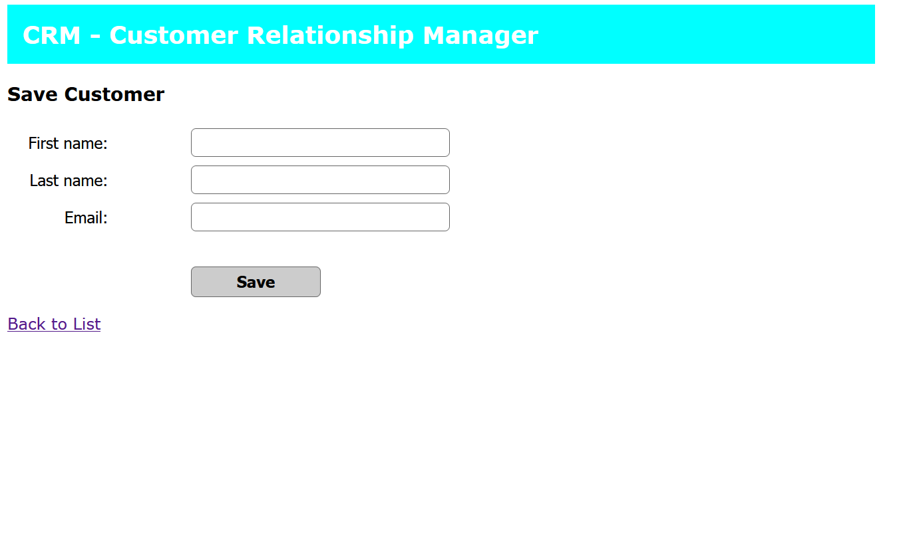
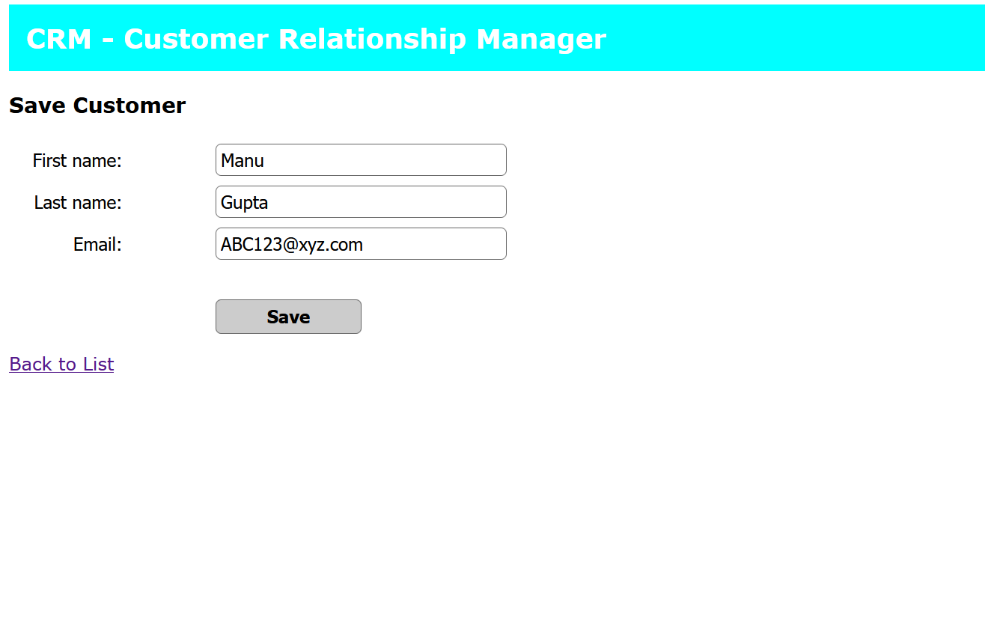
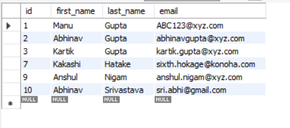
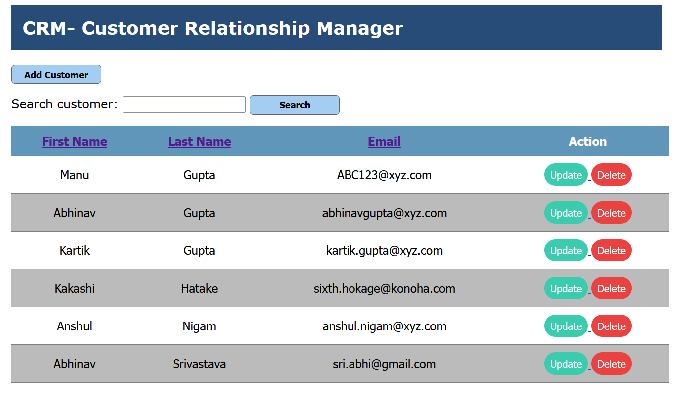
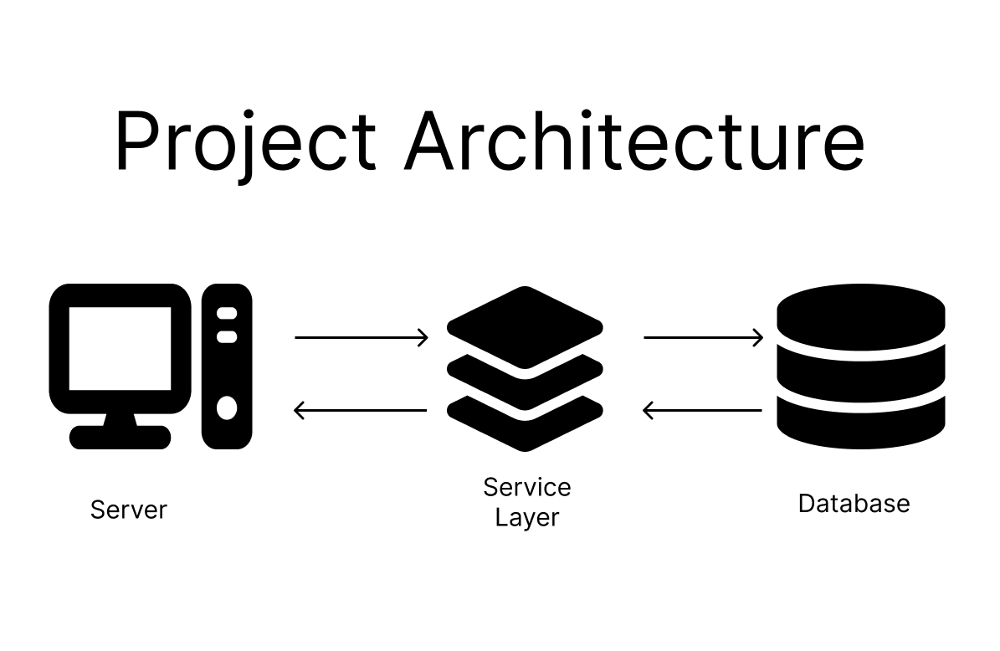

# Customer Relationship Manager

In this project, one can keep a record of the customers and perform the basic create, read, update, and delete operations on them.
Additionally, real-time database updates are incorporated.

## Technology Used

It is developed using Spring Framework and HTML, CSS for the basic frontend. 
The project implements Hibernate and MySQL for database integration.

## Project Working and Visuals

• We can add new customers by using the add customer button at the top. It opens a new page where we can fill in the details of the customer.

• There is also the functionality of updating the existing data of customers.

• When we click the update button, a new page is loaded, which is prepopulated with the customer's data.

• All the changes made are updated in real time in the database.

• There are also some extra features for searching for a customer and sorting by a desired field. The search button can be used to find particular details. 
  The search function is case-independent.

• If we wish to sort the table by a desired field, it can be done by simply clicking on the column title. (Sorted by Last Name here)

• Also, a service layer was introduced for interaction between the server and database. This adds more flexibility and adaptability to the project.

## Usage

The project is built using the Spring Framework and the Apache Tomcat Server. The source code can be found under the "src" folder.
